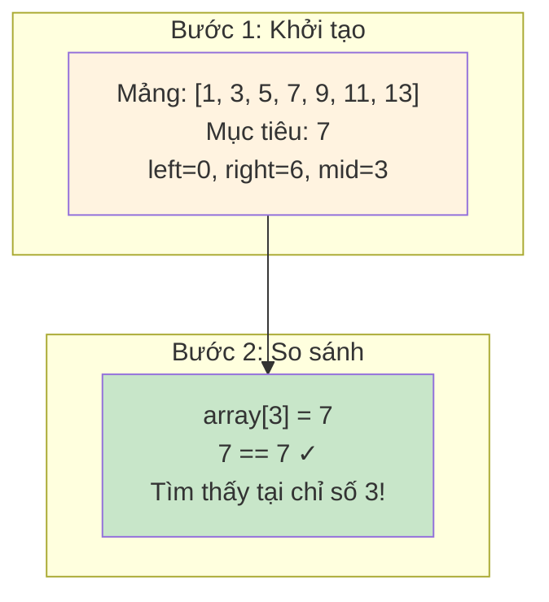

# Bảng Tham Khảo Nhanh

## Demo Thuật Toán Tìm Kiếm Nhị Phân

```mermaid
flowchart TD
    A[Bắt đầu: Mảng đã sắp xếp, giá trị mục tiêu] --> B[Đặt left = 0, right = array.length - 1]
    B --> C{left <= right?}
    C -->|Không| D[Không tìm thấy mục tiêu, trả về -1]
    C -->|Có| E[Tính mid = left + (right - left) / 2]
    E --> F{array[mid] == target?}
    F -->|Có| G[Tìm thấy! Trả về chỉ số mid]
    F -->|Không| H{array[mid] < target?}
    H -->|Có| I[Đặt left = mid + 1]
    H -->|Không| J[Đặt right = mid - 1]
    I --> C
    J --> C
    
    style A fill:#e1f5fe
    style G fill:#c8e6c9
    style D fill:#ffcdd2
```

## Ví Dụ Minh Họa



Nội dung bảng tham khảo nhanh...
