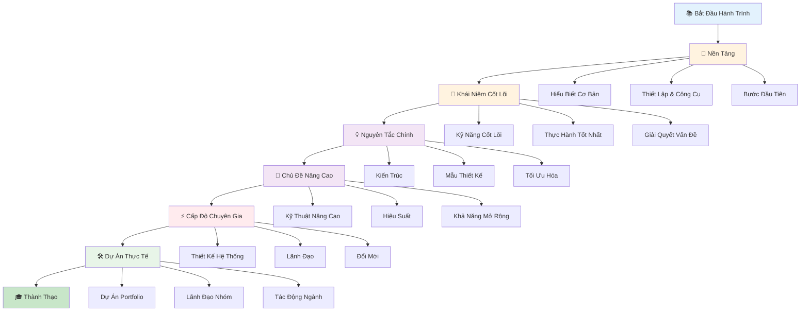
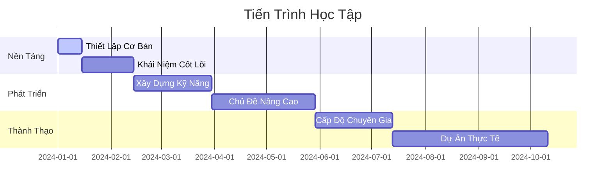

# Bắt Đầu

## Tổng Quan Lộ Trình Học Tập

## Thời Gian Biểu & Cột Mốc

Chào mừng bạn đến với hành trình học tập! Tài liệu này sẽ hướng dẫn bạn qua mọi thứ bạn cần biết, từ những điều cơ bản đến các khái niệm nâng cao.
